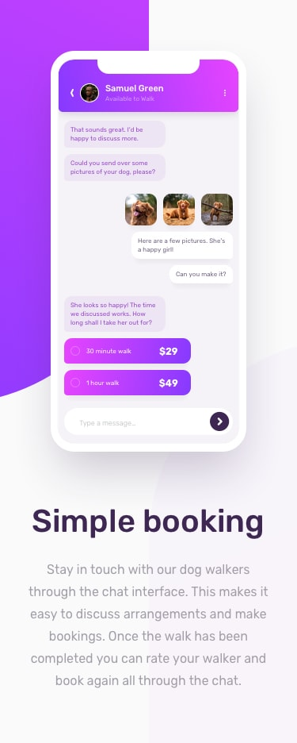

# fm-chat-app-illustration (Chat App Illustration)

## Design

> Desktop

> Mobile

## General

My challenge is to build out this feature illustration using HTML & CSS and get it looking as close to the design as possible.

The only assets provided in this challenge are the image of the person in the app UI and the 3 images of the dog. I need to create everything else using HTML & CSS!

My users should be able to:

- View the optimal layout for the component depending on their device's screen size
- See the chat interface animate on the initial load *(optional)*